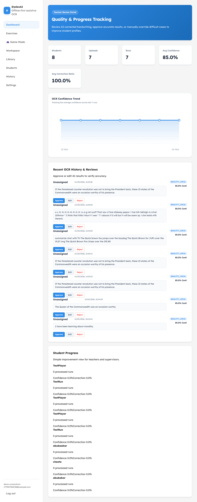
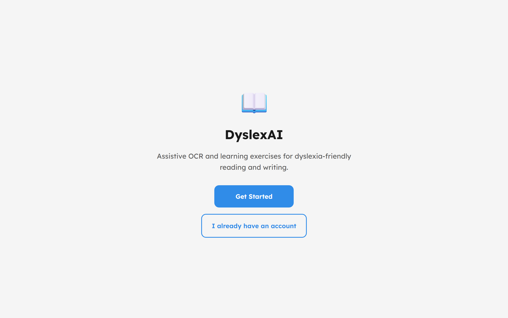
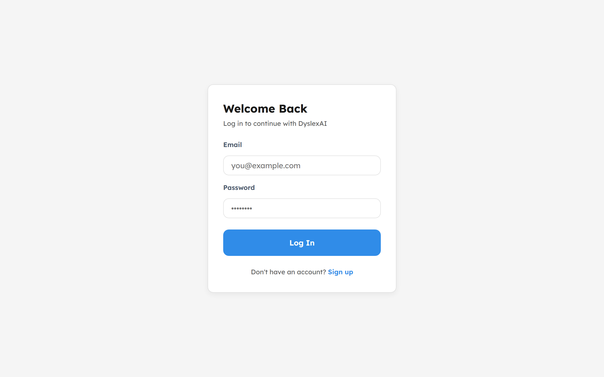
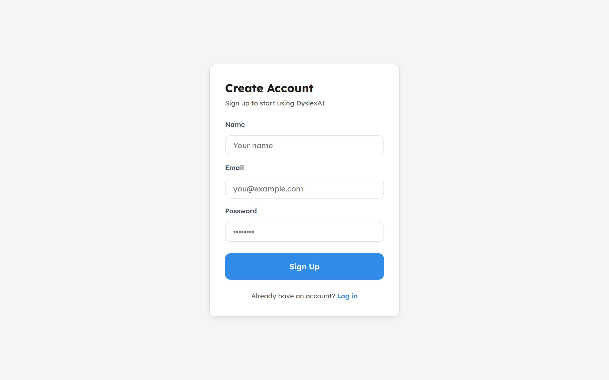
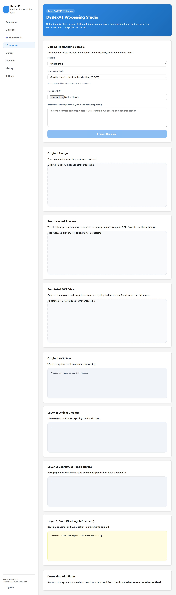
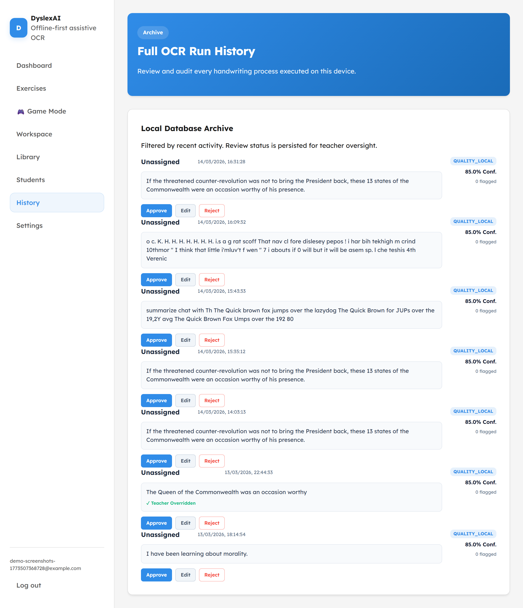
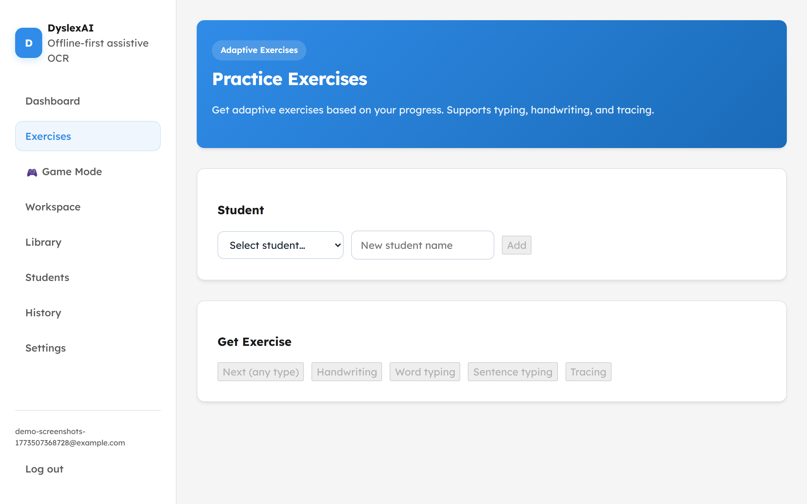
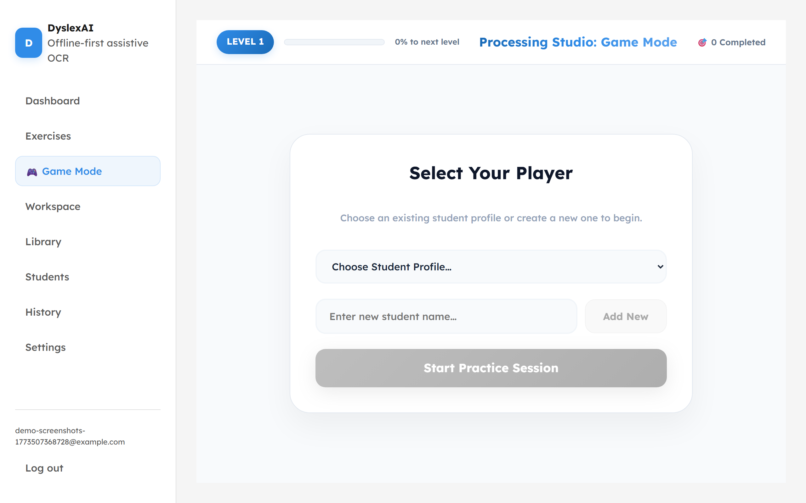
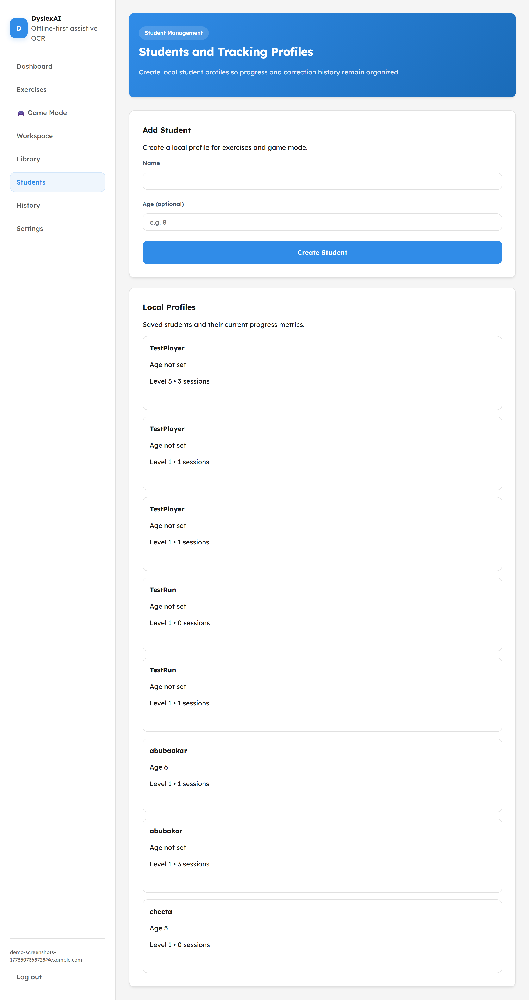
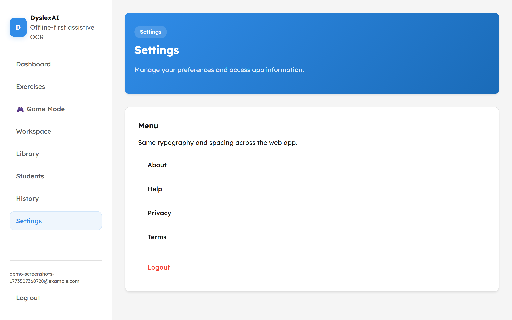

# DyslexAI

**Local-first OCR and adaptive exercises for dyslexic students.**

DyslexAI is a web application that combines a handwriting OCR pipeline with an adaptive exercise system designed for dyslexic learners. It extracts handwritten text, corrects OCR noise, and turns the results into personalized typing, handwriting, and tracing exercises.

**Status:** Demo-ready and suitable for FYP presentation and portfolio use.

<p align="center">
  
</p>

[](https://python.org)
[](https://fastapi.tiangolo.com)
[](https://reactjs.org)

## Key Features

| Feature | Description |
| --- | --- |
| **Hybrid OCR** | DocTR detection plus TrOCR recognition through the notebook-parity pipeline |
| **Correction pipeline** | Lexical cleanup, ByT5 repair, and optional Groq LLM support |
| **Adaptive exercises** | Word typing, sentence typing, handwriting, and tracing modes |
| **Student dashboard** | Progress tracking, OCR history, and word mastery |
| **Tracing canvas** | On-screen tracing with stroke capture |
| **Offline-first OCR** | Designed to run locally without requiring cloud OCR services |

## Screenshots

### Landing and Auth


*Landing page*


*Login page*


*Signup page*

### Main App


*Dashboard with metrics and OCR history*


*Upload workspace for handwriting OCR*


*OCR processing and correction interface*


*OCR history view*

### Exercises and Management


*Exercise selection*


*Gamified exercise mode*


*Student management*


*Settings page*

To recapture screenshots:

```powershell
.\scripts\run-simple.ps1
cd frontend
npm run screenshots
```

## Tech Stack

- Frontend: React 18, Vite, TypeScript
- Backend: FastAPI, SQLAlchemy, Uvicorn
- OCR: DocTR, TrOCR, ByT5, optional Groq LLM
- Database: SQLite by default, PostgreSQL optional

## Architecture Summary

- Active backend: `dyslexia-backend/`
- Active frontend: `frontend/`
- Active OCR route: `POST /api/ocr/process`
- Default OCR mode: `notebook_parity`

## Repository Structure

```text
dyslexai-/
|-- dyslexia-backend/   # OCR, auth, dashboard, and exercise backend
|-- frontend/           # React application
|-- scripts/            # setup and run scripts
|-- docs/               # architecture, run guides, notes
|-- tests/              # unit and integration tests
`-- screenshots/        # supporting visual proof
```

## Why This Project Matters

This is one of the strongest repositories in the profile because it demonstrates:

- OCR pipeline design
- applied AI for accessibility
- full-stack product thinking
- student-facing adaptive workflows
- proof-driven documentation with real screenshots

## Author

Abubakar Shahid  
GitHub: <https://github.com/abubakarshahid16>
